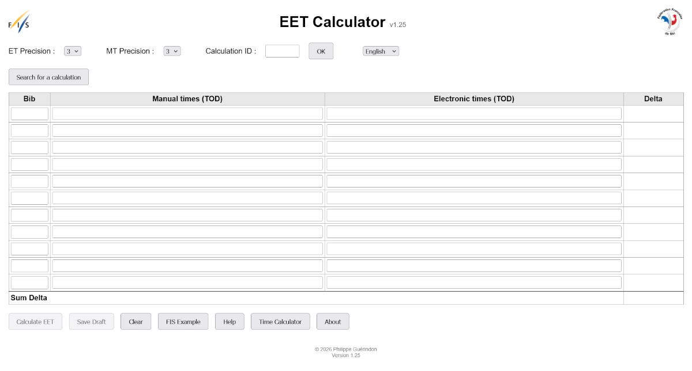
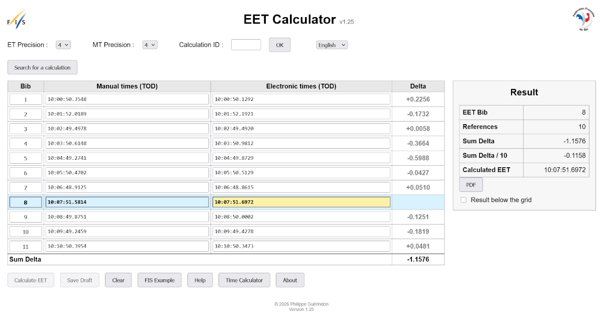

<p align="center">
  
</p>

<h1 align="center">EET Calculator</h1>

<p align="center">
  <strong>FIS Equivalent Electronic Time Calculator &amp; Exchange Platform</strong>
</p>

---

# EET Calculator

**Version:** 1.22
**EEP Protocol:** 1.0

EET Calculator is a web application that computes the **Equivalent Electronic Time (EET)** in accordance with the timing rules of the **International Ski and Snowboard Federation (FIS)**.

The application reconstructs a competitor's missing electronic time from the electronic and manual times of previously started competitors, following the official FIS procedure.

All computations are performed internally in **microseconds**, ensuring maximum accuracy before truncation to the required timing precision.

---

# Highlights

- ✅ Fully compliant with FIS EET calculation rules
- ✅ EEP (Equivalent Electronic Time Exchange Protocol) v1.0
- ✅ Internal business document (*Single Source of Truth*)
- ✅ Microsecond calculation engine
- ✅ Independent Web and JSON workflows
- ✅ Calculation Key support
- ✅ Automatic PDF report generation
- ✅ Public calculation search
- ✅ Multilingual interface (French, English, German)
- ✅ Validated on Windows and Ubuntu (Gunicorn + Nginx)

---

# What's New in Version 1.22

Version 1.22 stabilizes the internal architecture of the application.

Major improvements include:

- Complete separation between **Web calculations** and **persistent JSON calculations**.
- Independent management of the displayed document and the Web session history.
- Two-level Web calculation history allowing instant document swapping.
- Persistent calculations identified by a **Calculation Key**.
- Improved read-only workflow.
- Simplified session management.
- Cleaner separation of responsibilities between business modules.

---

# Documentation

EET Calculator implements the **Equivalent Electronic Time Exchange Protocol (EEP)**.

The complete protocol specification is available here:

## Documentation

- [EEP Specification (Markdown)](documentation/EEP_Specification_v1.1.md)
- [EEP Specification (PDF)](documentation/EEP_Specification_v1.1.pdf)

---

# Architecture

The application is designed around a single validated business document.

This document represents the complete state of a calculation independently from:

- the web interface,
- PDF reports,
- JSON exchange files,
- future external interfaces.

It is therefore the **Single Source of Truth** for the entire application.

```
                 Browser
                    │
                    ▼
               Flask Routes
                    │
                    ▼
               Web Actions
                    │
                    ▼
                  Adapter
                    │
                    ▼
                 Workflow
                    │
                    ▼
                 Calculator
                    │
                    ▼
                 Validator
                    │
                    ▼
          Internal Business Document
          (Single Source of Truth)
             ╱         │         ╲
         HTML        JSON       PDF
```

## Internal Architecture

The application distinguishes three complementary concepts.

### WORK_DOCUMENT

Represents the document currently displayed by the application.

The displayed document may originate from:

- a new Web calculation,
- a JSON import,
- a Calculation Key recall,
- a public search.

Only one WORK_DOCUMENT exists at any time.

### Web Session History

Two session documents are maintained for interactive use:

- CURRENT_CALCULATION
- PREVIOUS_CALCULATION

These documents are updated **only** by Web calculations.

They provide the **Swap** function between the last two calculations.

### Persistent JSON Calculations

Calculations imported from timing software are stored permanently.

Each calculation is uniquely identified by a **Calculation Key** and can later be:

- recalled,
- searched,
- exported,
- recalculated.

Persistent calculations never modify the Web session history.

---

# Workflow Overview

The application supports two completely independent workflows.

## Web Workflow

```
New Calculation
        │
        ▼
Calculation
        │
        ▼
CURRENT_CALCULATION
        │
        ▼
Swap with PREVIOUS_CALCULATION
```

## JSON Workflow

```
Import JSON
      │
      ▼
Calculation
      │
      ▼
Persistent Storage
      │
      ├── Recall by Calculation Key
      └── Public Search
```

Although independent, both workflows rely on the same internal business document and calculation engine.

# Main Features

The application provides all the tools required by Technical Delegates and timing specialists to calculate, validate, archive and retrieve Equivalent Electronic Times.

## Calculation

- Equivalent Electronic Time (EET) calculation
- Full compliance with FIS timing rules
- Internal calculations performed in microseconds
- Automatic truncation to the required timing precision
- Support for configurable ET and MT precisions

## Validation

- Validation of imported JSON documents
- Validation of manually entered Web calculations
- Automatic consistency checks
- Detection of invalid or incomplete data

## Document Management

- Web calculation history
- Calculation swap
- Persistent JSON calculations
- Recall by Calculation Key
- Public search
- Automatic PDF report generation

## User Interface

- Responsive Web interface
- French
- English
- German
- Automatic formatting of timing values
- Immediate validation feedback

---

# Supported Workflows

## 1. Web Calculation

A Technical Delegate manually enters:

- race information,
- competitor bib numbers,
- manual times,
- electronic times.

The application computes the missing electronic time immediately.

The two latest Web calculations remain available for instant swapping.

---

## 2. JSON Import

Timing software may export a calculation request using the **EEP 1.0** format.

The imported document is:

- validated,
- completed,
- calculated,
- stored,
- exportable.

---

## 3. Recall by Calculation Key

Every stored calculation receives a unique **Calculation Key**.

Entering this key immediately restores the corresponding calculation.

The recalled document can then be:

- reviewed,
- recalculated,
- exported as PDF.

---

## 4. Public Search

Stored calculations may also be retrieved using:

- season,
- codex,
- bib number.

Public search displays anonymous PDF reports while preserving competitor privacy.

---

# Internal Components

| Module | Purpose |
|---------|---------|
| `document.py` | Internal business document |
| `validator.py` | Validation of imported and edited documents |
| `calculator.py` | FIS EET calculation engine |
| `workflow.py` | Business workflow orchestration |
| `adapter.py` | Conversion between EEP JSON and the internal document |
| `actions.py` | Flask actions |
| `session.py` | Session management and Web history |
| `pdf.py` | PDF report generation |
| `translation.py` | Internationalization |

---

# Project Structure

```text
app.py
config.py
run.py
requirements.txt

actions.py
adapter.py
calculator.py
document.py
pdf.py
session.py
translation.py
validator.py
workflow.py

templates/
static/
tests/
documentation/
```

---

# Screenshots

## Main Screen



---

## Calculation Result



---

# Sample PDF Report

📄 [Open sample PDF report](images/PDF_example.pdf)

# Installation

## Requirements

- Python 3.14 or later
- pip
- python3-venv

Clone the repository:

```bash
git clone https://github.com/<your-account>/EET_Calculator.git
cd EET_Calculator
```

Create a virtual environment:

### Linux

```bash
python3 -m venv venv
source venv/bin/activate
```

### Windows

```cmd
python -m venv venv
venv\Scripts\activate
```

Install the dependencies:

```bash
pip install -r requirements.txt
```

---

# Running the Application

## Development

```bash
python run.py
```

or

```bash
python app.py
```

The application is then available at:

```
http://localhost:5000
```

---

## Production

The application has been successfully validated on:

- Ubuntu Server LTS
- Gunicorn
- Nginx
- Python virtual environment

Typical deployment architecture:

```
Browser
    │
HTTPS
    │
Nginx
    │
Gunicorn
    │
Flask
    │
Business Modules
```

Deployment documentation is available in the `documentation/` directory.

---

# Testing

The calculation engine is completely independent of the Web interface.

Unit tests validate:

- time conversions
- EET calculations
- workflow execution
- document validation
- precision handling

Tests are located in the `tests/` directory.

---

# Design Principles

The project is based on a small number of architectural principles.

## Single Source of Truth

The internal business document contains the complete state of a calculation.

Every interface is generated from this validated document:

- HTML
- PDF
- JSON (EEP)
- future interfaces

No business logic is duplicated.

---

## Separation of Responsibilities

Each module has a single responsibility.

| Module | Responsibility |
|---------|----------------|
| Document | Business model |
| Validator | Data validation |
| Calculator | EET calculations |
| Workflow | Business orchestration |
| Adapter | JSON ↔ Document conversion |
| Session | Web history management |
| PDF | Report generation |
| Translation | Internationalization |

---

## Independent Workflows

The application distinguishes two independent workflows.

### Web Workflow

Designed for Technical Delegates performing manual calculations.

Characteristics:

- editable document
- two-calculation history
- instant swap
- session-based

### JSON Workflow

Designed for timing software interoperability.

Characteristics:

- EEP import/export
- persistent storage
- Calculation Key
- public search
- PDF generation

Both workflows use exactly the same calculation engine and business model.

---

## Precision

All internal calculations are performed in **microseconds**.

Only the displayed and exported values are truncated according to the configured timing precision.

This guarantees:

- maximum numerical accuracy
- deterministic calculations
- identical results regardless of the input source

---

# Future Development

The architecture has been designed to facilitate future extensions, including:

- additional exchange protocols
- REST API
- authentication and user management
- digital signatures
- federation integration
- additional export formats

No redesign of the business model should be required.

---

# License

Copyright © 2026 Philippe Guérindon

This software is proprietary.

See the accompanying **LICENSE** file for the complete license terms.

The accompanying **EEP Specification** is distributed under its own
copyright and permission terms.
