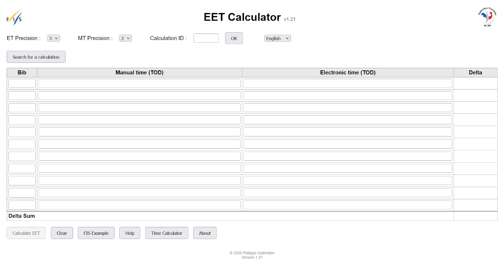
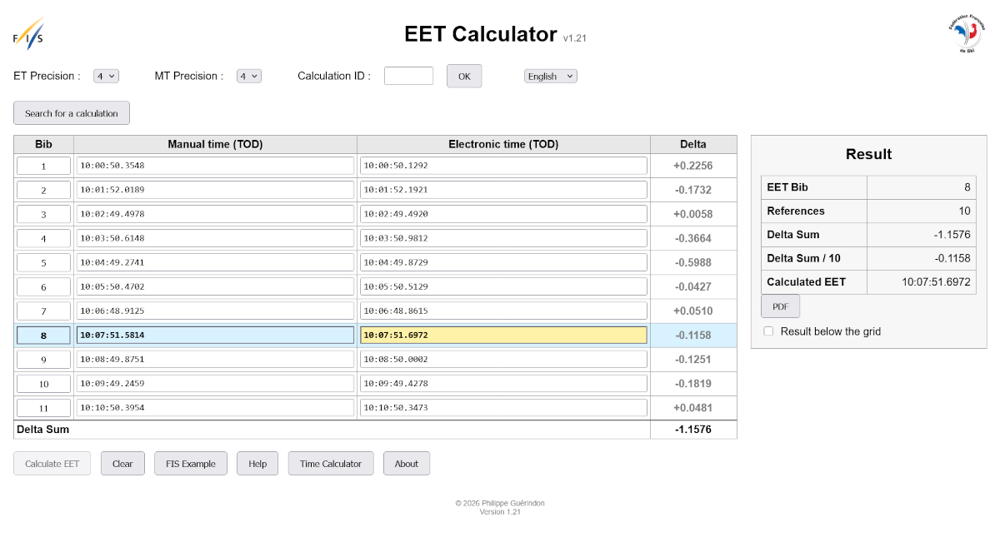

# EET Calculator

**Version:** 1.21  
**EEP Protocol:** 1.0

EET Calculator is a web application that computes the **Equivalent Electronic Time (EET)** according to the timing rules of the **International Ski and Snowboard Federation (FIS)**.

The application determines the missing electronic time of a competitor from the electronic and manual times of the previous competitors.

All calculations are performed internally in **microseconds** before truncation to the required timing precision, ensuring maximum calculation accuracy.

---

# Highlights

- ✅ Fully compliant with FIS EET calculation rules
- ✅ EEP 1.0 protocol support
- ✅ Internal business document model
- ✅ Microsecond calculation engine
- ✅ Multilingual interface (French, English, German)
- ✅ Automatic PDF report generation
- ✅ Public calculation search
- ✅ Recall of previous calculations
- ✅ Validated on Windows and Ubuntu (Gunicorn + Nginx)

---

# What's New in Version 1.21

- First version fully compliant with **EEP 1.0**.
- Separation between the **EEP exchange schema** and the **internal business model**.
- Complete workflow implementation:
  - New EET calculation
  - Public read-only search
  - Recall by `calculation_id`
- Automatic generation of:
  - Anonymous PDF reports for public searches
  - Complete PDF reports for recalled calculations
- Session document swapping.
- Production deployment validated under Ubuntu.

---

# Architecture

The application is designed around a single internal business document.

The document represents the complete state of a calculation independently of the web interface, PDF generation or EEP exchange protocol.

```
                 Browser
                     │
                     ▼
              Flask Routes
                     │
                     ▼
              Web Actions
                     │
                     ▼
                 Adapter
                     │
                     ▼
                 Workflow
                     │
                     ▼
                Calculator
                     │
                     ▼
                 Validator
                     │
                     ▼
          Internal Business Document
          (Single Source of Truth)
             ╱         │         ╲
         HTML        JSON       PDF
```

## Workflow


---

# Main Features

- Equivalent Electronic Time (EET) calculation
- Full compliance with FIS timing rules
- Responsive user interface
- Microsecond internal calculations
- Configurable timing precision
- Automatic validation of imported data
- Public calculation search
- PDF report generation
- Session history management
- Reload previous calculation
- Multilingual interface

Supported languages:

- Français
- English
- Deutsch

---

# Screenshots

## Main Screen



## Calculation Result



---

# Sample PDF Report

📄 [Open sample PDF report](images/PDF_example.pdf)

---

# Internal Components

| Module | Purpose |
|--------|---------|
| `document.py` | Internal business document |
| `validator.py` | Validation of imported and edited documents |
| `calculator.py` | FIS EET calculation engine |
| `workflow.py` | Business workflow orchestration |
| `adapter.py` | Conversion between EEP and the internal document |
| `actions.py` | Flask actions |
| `session.py` | Session document management |
| `pdf.py` | PDF report generation |
| `translation.py` | Internationalization |

---

# Installation

## Requirements

- Python 3.12 or later
- pip
- python3-venv

## Create a virtual environment

```bash
python -m venv venv
```

### Linux

```bash
source venv/bin/activate
```

### Windows

```cmd
venv\Scripts\activate
```

## Install dependencies

```bash
pip install -r requirements.txt
```

---

# Running the Application

Development mode:

```bash
python run.py
```

The application is then available at:

```
http://localhost:5000
```

---

# Production Deployment

The application has been validated using:

- Gunicorn
- Nginx
- Ubuntu Linux

Deployment procedures are available in the `docs/` directory.

---

# Project Structure

```
app.py
config.py
run.py
requirements.txt

actions.py
adapter.py
session.py

document.py
validator.py
calculator.py
workflow.py

pdf.py
translation.py

templates/
static/
tests/
docs/
```

---

# Testing

The calculation engine is completely independent from the web interface.

Unit tests validate:

- time conversions
- EET calculations
- document validation
- workflow execution

The test suite is located in the `tests/` directory.

---

# Design Principles

The project is built around a simple principle:

> **The internal business document is the single source of truth.**

All interfaces (HTML pages, PDF reports and EEP JSON exchange files) are generated from the same validated document.

This architecture simplifies maintenance, testing and future protocol evolution.

---

# License

Developed by **Philippe Guérindon**.

All rights reserved.