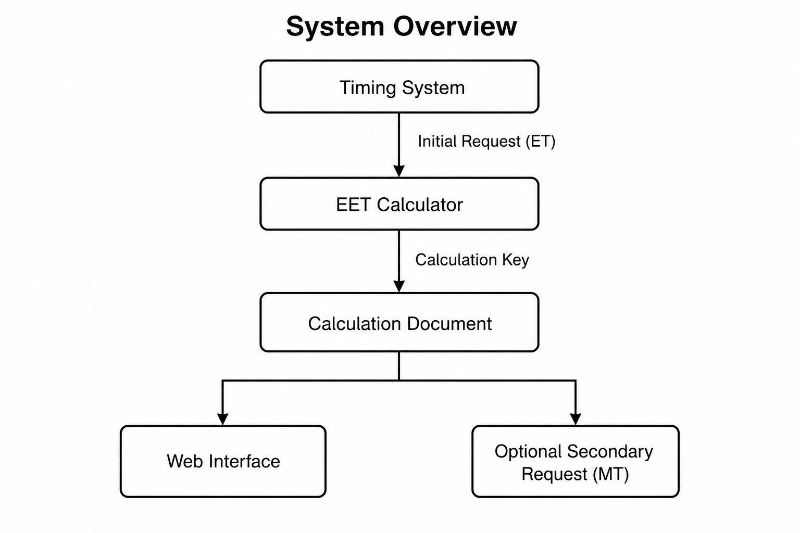
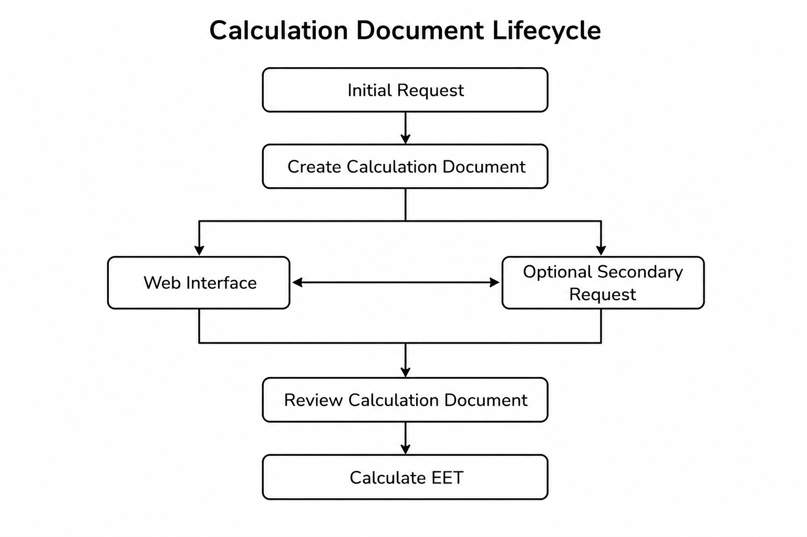

| Field | Value |
|-------|-------|
| Document | EEP Integration Guide |
| Document Type | Integration Guide |
| Version | 1.0 |
| Status | Official Release |
| Publication Date | July 2026 |
| Author | Philippe Guérindon |
| Official Repository | https://github.com/pguerindon/EET_calculator |

\newpage

# EEP Integration Guide

## Revision History

| Version | Date | Description             |
|:--------|:-----|:------------------------|
| 1.0     | 2026 | Initial public release. |

## Introduction

### Purpose

This guide explains how to integrate a Timing System with the EET Calculator using the Electronic Equivalent Time Exchange Protocol (EEP).

### Scope

This guide describes:

- EET Calculator architecture;
- Calculation Model;
- Initial Request;
- Optional Secondary Request;
- EEP Endpoints;
- Integration Recommendations.

Request and response bodies are defined in the EEP Specification.

### Related Documents

- EEP Specification
- EET Calculator Administrator Guide


# System Overview

An Initial Request creates a Calculation Document from the supplied Electronic Times (ET) and returns a unique Calculation Key.

Optional Secondary Requests enrich the same Calculation Document by providing Manual Times (MT) using its Calculation Key.

The Calculation Document is then available in the web interface using its Calculation Key.

```{=latex}
\newpage
```



# Calculation Model

The EET Calculator manages each calculation as a Calculation Document identified by a unique Calculation Key.

A Calculation Document:

- is created by an Initial Request;
- may be enriched by Optional Secondary Requests;
- is then processed through the web interface.

The Calculation Key uniquely identifies the Calculation Document throughout its lifetime.

## Calculation Document

The Calculation Document is the persistent representation of an EET calculation.

It contains all information required for calculation and reporting.

It may be progressively enriched by Optional Secondary Requests before calculation.

## Calculation Key

It is assigned when the Calculation Document is created.

The same Calculation Key shall be used in all subsequent requests related to that Calculation Document.

## Calculation Lifecycle

The lifecycle of a Calculation Document comprises three phases:

1. Creation by an Initial Request.
2. Optional enrichment by one or more Secondary Requests.
3. Completion and calculation through the web interface.



# Initial Request

## Purpose

Creates a new Calculation Document from the supplied Electronic Times (ET).

## Processing

Upon successful validation, the server creates and persists a new Calculation Document.

## Multiple Requests

Each request is independent. Repeating the same request creates a new Calculation Document with a different Calculation Key.


# Optional Secondary Request

## Purpose

Enriches an existing Calculation Document by providing Manual Times (MT).

## Processing

Upon successful validation, updates and persists the Calculation Document identified by its Calculation Key.

## Multiple Requests

Each request updates the same Calculation Document. Previously supplied Manual Times are replaced by the new values.


# EEP Endpoints

| Endpoint | HTTP Method | Purpose |
|----------|:-----------:|---------|
| Initial Request | POST | Creates a Calculation Document |
| Optional Secondary Request | POST | Enriches a Calculation Document |

Request and response bodies are defined in the EEP Specification.

Every successful EEP request returns the associated Calculation Key.

Error responses are defined in the EEP Specification.


# Integration Recommendations

- Preserve the Calculation Key for the lifetime of the Calculation Document.
- Avoid duplicate Initial Requests.