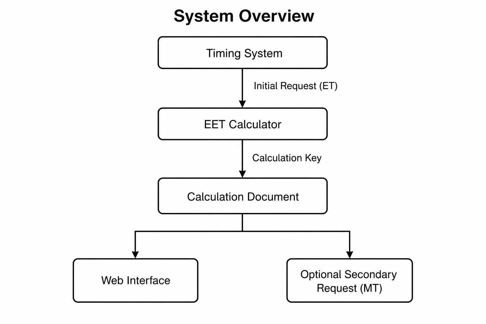
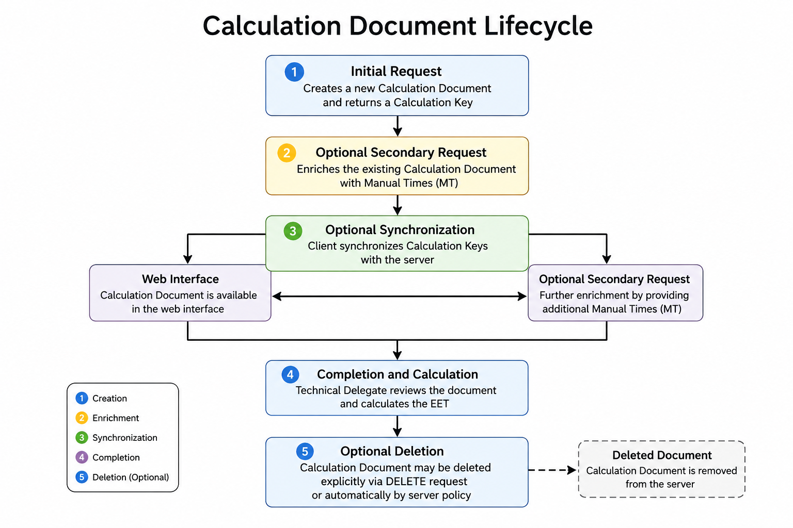

| Field | Value |
|-------|-------|
| Version | 1.1 |
| Status | Official Release |
| Publication Date | August 2026 |

\newpage

# EEP Integration Guide

## Revision History

| Version | Date | Description |
|:--------|:-----|:------------|
| 1.1 | 2026 | Added synchronization workflow, direct calculation recall, server version reporting and integration recommendations. This version is also applicable to EEP Specification Version 1.2. |
| 1.0 | 2026 | Initial public release. |

## Introduction

### Purpose

This guide explains how to integrate a Timing System with the EET Calculator using the Electronic Equivalent Time Exchange Protocol (EEP).

### Scope

This guide describes:

- EET Calculator architecture;
- Calculation Document;
- Initial Request;
- Optional Secondary Request;
- EEP Endpoints;
- Integration Recommendations.
- Calculation synchronization;
- Direct calculation recall;
- Server version reporting.

Request and response bodies are defined in the EEP Specification.

### Related Documents

- EEP Specification
- EET Calculator Administrator Guide


# System Overview

An Initial Request creates a Calculation Document from the supplied Electronic Times (ET) and returns a unique Calculation Key.

Optional Secondary Requests enrich the same Calculation Document by providing Manual Times (MT) using its Calculation Key.

The Calculation Document is then available in the web interface using its Calculation Key.

```{=latex}
\newpage
```

{ width=80% }

## Calculation Document

The Calculation Document is the persistent representation of an EET calculation.

Its structure and lifecycle are defined in the EEP Specification.

A Calculation Document:

- is created by an Initial Request;
- may be progressively enriched by Optional Secondary Requests;
- is then processed through the EET Calculator web interface.

Each Calculation Document is uniquely identified by a Calculation Key throughout its lifetime.

At any time, only one Calculation Document exists on the server for a given Calculation Key.

Whenever an Initial Request is accepted, the newly created Calculation Document replaces any previously stored Calculation Document associated with the same Calculation Key.

## Calculation Key

It is assigned when the Calculation Document is created.

The Calculation Key shall be used in all Optional Secondary Requests related to that Calculation Document.

## Calculation Lifecycle

1. Creation by an Initial Request.
2. Optional enrichment by one or more Secondary Requests.
3. Optional synchronization with the server.
4. Completion and calculation through the web interface.

Calculation Documents may subsequently be deleted automatically according to the server retention policy.

- 7 days for a TEST calculation
- Otherwise, calculations from season N-2 and earlier may be deleted.

{ width=90% }

# Initial Request

## Purpose

Creates a new Calculation Document from the supplied Electronic Times (ET).

## Processing

Upon successful validation:

- a new Calculation Document is created;
- a new Calculation Key is assigned;
- the Calculation Document is persisted on the server.

The Calculation Key is returned to the client application and should be stored locally together with the Calculation Document for future synchronization, direct recall and Optional Secondary Requests.

## Multiple Requests

Each Initial Request is independent.

Submitting the same Electronic Times more than once creates a new Calculation Document with a new Calculation Key.

# Optional Secondary Request

## Purpose

Enriches an existing Calculation Document by providing Manual Times (MT).

## Processing

Upon successful validation:

- the supplied Manual Times are incorporated into the Calculation Document identified by its Calculation Key;
- a new version of the Calculation Document is created;
- the previous version is removed from the server;
- the new version is persisted using the same Calculation Key.

## Multiple Requests

Multiple Optional Secondary Requests may be submitted for the same Calculation Key.

Each accepted request updates the Calculation Document identified by its Calculation Key.

# Calculation Synchronization

Timing software may periodically synchronize any locally stored Calculation Keys with the EET Calculator server.

The synchronization request allows the client application to determine whether each locally stored calculation still exists on the server.

## Request

**POST** `/api/eep/synchronization`

Request body:

```json
{
  "calculation_ids": [
    "1fpH6G",
    "1fpZPH",
    "1fqkBF",
    "1fqlPg"
  ]
}
```

The `calculation_ids` array contains the Calculation Keys currently stored by the client application.

## Response

Example:

```json
{
  "calculations": {
    "1fpH6G": {
      "exists": true
    },
    "1fpZPH": {
      "exists": false
    },
    "1fqkBF": {
      "exists": true
    }
  }
}
```

For each submitted Calculation Key:

- `exists = true` indicates that the calculation is still available on the server.
- `exists = false` indicates that the calculation has been removed from the server.

## Recommended Client Behaviour

For each synchronized Calculation Key:

- if `exists` is `true`, keep the local calculation;
- if `exists` is `false`, the client application may inform the user that the calculation no longer exists on the server and optionally delete the obsolete local file after user confirmation.

To keep the local repository consistent with the server, it is recommended to perform a synchronization immediately after a successful Initial Request has been accepted by the server. This allows newly created calculations to be registered locally while identifying obsolete calculations that may no longer exist on the server.

Synchronization helps maintain consistency between the local calculation repository and the calculations currently available on the EET Calculator server.

# Direct Calculation Recall

A Calculation Document may be recalled directly through its Calculation Key.

This mechanism allows:

- review of an existing calculation;
- manual completion of missing Manual Times;
- PDF generation;
- further processing by the Technical Delegate.

The recalled Calculation Key remains visible in the user interface.

## Direct Link

A Calculation Document may be opened directly by constructing a URL containing its Calculation Key.

Format:

```text
https://pg-chrono.fr/api/calculation/<CalculationKey>
```

Example:

```text
https://pg-chrono.fr/api/calculation/1fpH6G
```

Opening this URL in the user's default web browser recalls the corresponding Calculation Document.

If the Calculation Key is unknown or no longer exists on the server, the application displays an appropriate error message.

# EEP Endpoints

| Endpoint | HTTP Method | Purpose |
|----------|:-----------:|---------|
| Initial Request | POST | Creates a Calculation Document |
| Optional Secondary Request | POST | Enriches a Calculation Document |
| Calculation Synchronization | POST | Verifies Calculation Keys |
| Calculation Recall | GET | Opens a Calculation Document |

Request and response bodies are defined in the EEP Specification.

Every successful EEP request returns the associated Calculation Key.

Error responses are defined in the EEP Specification.

Calculation Synchronization returns the existence status of each supplied Calculation Key.

Calculation Recall opens the corresponding Calculation Document in the web interface.

# Server Version Reporting

Every successful EEP response includes informational messages indicating:

- the implemented EEP protocol version;
- the implemented EET Calculator version.

These messages are intended for diagnostic purposes and allow client software to verify compatibility with the server implementation.

Client software should treat these messages as informational only.

# Integration Recommendations

- Preserve the Calculation Key returned by a successful Initial Request.
- Use the Calculation Key only for Optional Secondary Requests referring to the same Calculation Document.
- If the Electronic Times of the Initial Request are incorrect and a new calculation must be started, submit a new Initial Request without a Calculation Key.
- Periodically synchronize locally stored Calculation Keys.
- Use server version information to detect implementation differences.
- Ignore informational server messages not required by the application.