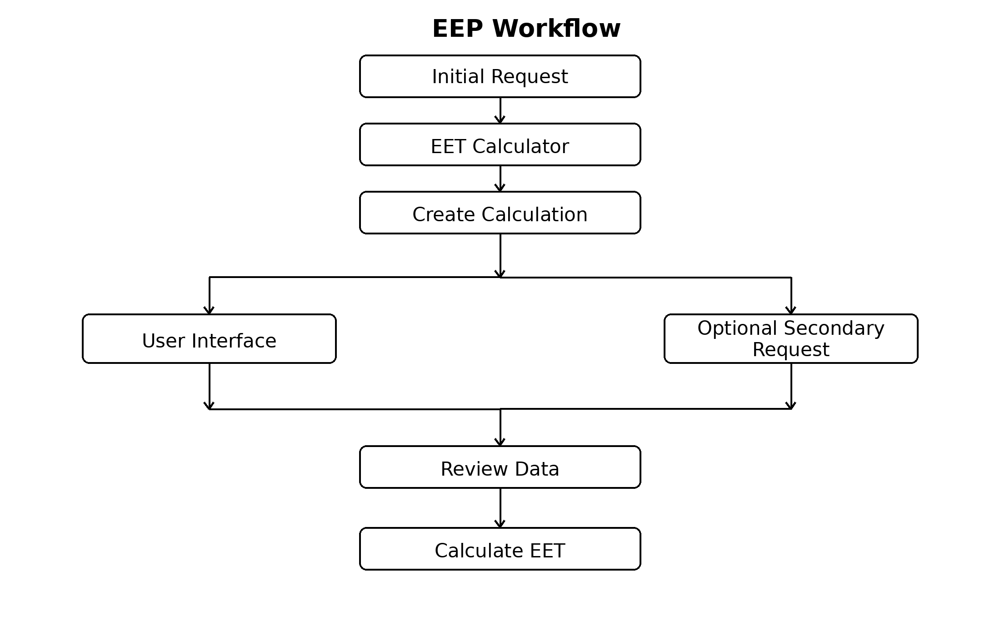

# Revision History

| Version | Date | Description             |
|:--------|:-----|:------------------------|
| 1.0     | 2026 | Initial public release. |

# Introduction

## Purpose

The Electronic Equivalent Time Exchange Protocol (EEP) defines a simple HTTP/JSON protocol for exchanging the data required to calculate an Equivalent Electronic Time (EET).

The protocol enables timing systems and EET calculation software to exchange a standardized JSON document through HTTP requests. It reduces manual data entry while preserving user control over the calculation process.

EEP specifies:

- the JSON document structure;
- the HTTP message exchange;
- the validation rules required for interoperability.

The protocol is independent of any timing software or EET calculation implementation. It defines only the exchange of data required to perform an EET calculation.

The protocol does not define the EET calculation itself.

## Design Goals

EEP has been designed with the following objectives:

- simple implementation;
- minimal manual data entry;
- backward-compatible extensibility.

# Workflow

The EEP workflow consists of one mandatory exchange and one optional exchange.

The Initial Request creates a new EET calculation and provides the electronic timing data available from the timing system.

The Manual Time (MT) may then be provided either through the EET Calculator user interface or by an Optional Secondary Request.

The user reviews the calculation data before validating the final Equivalent Electronic Time (EET).



# HTTP Interface

EEP uses HTTP POST requests with JSON payloads.

The endpoint URL is implementation-specific.

All requests and responses SHALL use the following content type:

```text
Content-Type: application/json
```

The protocol defines four message types.

| Message                    | Purpose                                     |
|:---------------------------|:--------------------------------------------|
| Initial Request            | Create a new EET calculation.               |
| Initial Response           | Return the assigned `calculation_id`.       |
| Optional Secondary Request | Provide the previously missing Manual Time. |
| Secondary Response         | Confirm the successful update.              |

A successful Initial Response assigns a unique `calculation_id` that SHALL be used in all subsequent requests related to the calculation.

# EEP Document

The EEP document is a JSON object exchanged between a timing system and an EET Calculator.

It consists of a root object containing race information and a list of competitors.

Optional members provide additional information intended to improve the presentation of the EET calculation result.

Member ordering has no semantic meaning.

## Root Object

The root object contains the calculation identifier, processing mode, race information and competitor list.

| Member             | Type   | Required | Description                                                                   |
|:-------------------|:-------|:--------:|:------------------------------------------------------------------------------|
| `calculation_id`   | string | Yes      | Unique calculation identifier. Empty in the Initial Request.                  |
| `mode`             | string | No       | Processing mode. The value `TEST` enables test mode. When omitted, production mode is assumed. |
| `race`             | object | Yes      | Race information.                                                             |
| `competitors`      | array  | Yes      | List of competitors.                                                          |

### Root Object Example

```json
{
  "calculation_id": "",
  "mode": "TEST",
  "race": {
    ...
  },
  "competitors": [
    ...
  ]
}
```

### 5.2 Race Object

The race object identifies the competition associated with the calculation and specifies the competitor for whom an Equivalent Electronic Time (EET) is requested.

| Member            | Type   | Required | Description                                              |
| ----------------- | ------ | -------- | -------------------------------------------------------- |
| season            | string | Yes      | Competition season.                                      |
| codex             | string | Yes      | Competition codex.                                       |
| run               | string | Yes      | Competition run number.                                  |
| missing_impulse   | string | Yes      | Missing timing impulse (`START` or `FINISH`).            |
| eet_bib           | string | Yes      | Bib number of the competitor requiring an EET.           |
| name              | string | No       | Competition name.                                        |
| discipline        | string | No       | Competition discipline.                                  |
| date              | string | No       | Competition date.                                        |
| location          | string | No       | Competition location.                                    |

#### 5.2.1 Race Object Example

```json
{
  "season": "2026",
  "codex": "1234",
  "run": "1",
  "missing_impulse": "START",
  "eet_bib": "14",
  "name": "National Championships",
  "discipline": "SL",
  "date": "2026-02-14",
  "location": "Val d'Isère"
}
```

## Competitor Object

Each element of the `competitors` array represents one competitor included in the EET calculation.

The competitor whose electronic timing impulse is missing is identified by an empty `et_tod` value in the Initial Request.

| Member      | Type   | Required | Description                             |
|:------------|:-------|:--------:|:----------------------------------------|
| `bib`       | string | Yes      | Competitor bib number.                  |
| `et_tod`    | string | Yes      | Electronic Time expressed as Time of Day. |
| `name`      | string | No       | Competitor first name.                  |
| `surname`   | string | No       | Competitor surname.                     |
| `nation`    | string | No       | Competitor nation.                      |
| `club`      | string | No       | Competitor club.                        |

### Competitor Object Example

```json
{
  "bib": "14",
  "et_tod": "",
  "name": "John",
  "surname": "Smith",
  "nation": "FRA",
  "club": "SC Val d'Isère"
}
```

## JSON Object Hierarchy

The following hierarchy summarizes the structure of the EEP JSON document.

```text
Root Object
|
+-- calculation_id
|
+-- mode
|
+-- race
|   |
|   +-- season
|   +-- codex
|   +-- run
|   +-- missing_impulse
|   +-- eet_bib
|   +-- name
|   +-- discipline
|   +-- date
|   +-- location
|
+-- competitors[]
    |
    +-- bib
    +-- et_tod
    +-- name
    +-- surname
    +-- nation
    +-- club
```

# Validation Rules

The following rules define the minimum validation requirements for protocol interoperability.

Implementations MAY perform additional business validation without affecting interoperability.

| Rule  | Description |
|:------|:------------|
| **VR-01** | The root object SHALL contain `calculation_id`, `race` and `competitors`.               |
| **VR-02** | The race object SHALL contain `season`, `codex`, `run`, `missing_impulse` and `eet_bib` |
| **VR-03** | Each competitor SHALL contain `bib` and `et_tod`.                                       |
| **VR-04** | The `competitors` array SHALL contain exactly eleven competitors.                       |
| **VR-05** | In an Initial Request, exactly one competitor SHALL have an empty `et_tod` value.       |
| **VR-06** | In an Optional Secondary Request, no `et_tod` value SHALL be empty.                     |
| **VR-07** | Every non-empty `et_tod` value SHALL contain at least three decimal places.             |
| **VR-08** | `season` SHALL consist of exactly four digits.                                          |
| **VR-09** | `missing_impulse` SHALL be either `START` or `FINISH`.                                  |
| **VR-10** | Unknown members SHALL be ignored to preserve forward compatibility.                     |

# Protocol Examples

The following examples illustrate the HTTP messages exchanged between a timing system and an EET Calculator.

The Optional Secondary Request differs from the Initial Request only by:

- the assigned `calculation_id`;
- the previously missing `et_tod` value.

For clarity, the examples include optional members. Implementations MAY omit any optional member.

Optional competitor members are shown only for the competitor whose electronic timing impulse is missing.

## Initial Request

```http
POST /eet HTTP/1.1
Content-Type: application/json
```

```json
{
  "calculation_id": "",
  "mode": "TEST",
  "race": {
    "season": "2026",
    "codex": "1234",
    "run": "1",
    "missing_impulse": "START",
    "eet_bib": "14",
    "name": "National Championships",
    "discipline": "SL",
    "date": "2026-02-14",
    "location": "Val d'Isère"
  },
  "competitors": [
    {
      "bib": "11",
      "et_tod": "10:16:12.481"
    },
    {
      "bib": "12",
      "et_tod": "10:16:24.106"
    },
    {
      "bib": "13",
      "et_tod": "10:16:32.547"
    },
    {
      "bib": "14",
      "et_tod": "",
      "name": "John",
      "surname": "Smith",
      "nation": "FRA",
      "club": "SC Val d'Isère"
    },
    {
      "bib": "15",
      "et_tod": "10:16:51.234"
    },
    {
      "bib": "16",
      "et_tod": "10:17:03.118"
    },
    {
      "bib": "17",
      "et_tod": "10:17:14.904"
    },
    {
      "bib": "18",
      "et_tod": "10:17:26.431"
    },
    {
      "bib": "19",
      "et_tod": "10:17:39.055"
    },
    {
      "bib": "20",
      "et_tod": "10:17:52.601"
    },
    {
      "bib": "21",
      "et_tod": "10:18:05.227"
    }
  ]
}
```

## Initial Response

```http
HTTP/1.1 200 OK
Content-Type: application/json
```

```json
{
  "status": "ok",
  "calculation_id": "A7F4K2"
}
```

## Optional Secondary Request

```http
POST /eet HTTP/1.1
Content-Type: application/json
```

```json
{
  "calculation_id": "A7F4K2",
  "mode": "TEST",
  "race": {
    "season": "2026",
    "codex": "1234",
    "run": "1",
    "missing_impulse": "START",
    "eet_bib": "14",
  },
  "competitors": [
    {
      "bib": "11",
      "et_tod": "10:16:12.481"
    },
    {
      "bib": "12",
      "et_tod": "10:16:24.106"
    },
    {
      "bib": "13",
      "et_tod": "10:16:32.547"
    },
    {
      "bib": "14",
      "et_tod": "10:16:40.216",
      "name": "John",
      "surname": "Smith",
      "nation": "FRA",
      "club": "SC Val d'Isère"
    },
    {
      "bib": "15",
      "et_tod": "10:16:51.234"
    },
    {
      "bib": "16",
      "et_tod": "10:17:03.118"
    },
    {
      "bib": "17",
      "et_tod": "10:17:14.904"
    },
    {
      "bib": "18",
      "et_tod": "10:17:26.431"
    },
    {
      "bib": "19",
      "et_tod": "10:17:39.055"
    },
    {
      "bib": "20",
      "et_tod": "10:17:52.601"
    },
    {
      "bib": "21",
      "et_tod": "10:18:05.227"
    }
  ]
}
```

## Secondary Response

```http
HTTP/1.1 200 OK
Content-Type: application/json
```

```json
{
  "status": "ok",
  "calculation_id": "A7F4K2"
}
```

> **Implementation Note**
>
> During processing of an Optional Secondary Request, implementations SHOULD update only the previously missing `et_tod` value. All other document members SHOULD be ignored.

# Appendix A — JSON Naming Conventions

EEP follows common JSON naming conventions.

| Convention | Rule |
|:-----------|:-----|
| Member names | lowercase |
| Word separator | underscore (`_`) |
| Arrays | plural nouns |
| Boolean values | JSON `true` / `false` |
| Null values | JSON `null` |
| Date format | ISO 8601 (`YYYY-MM-DD`) |
| Time of Day | `HH:MM:SS.sss` (minimum three decimal places) |

These conventions are recommendations intended to improve readability and consistency across implementations.